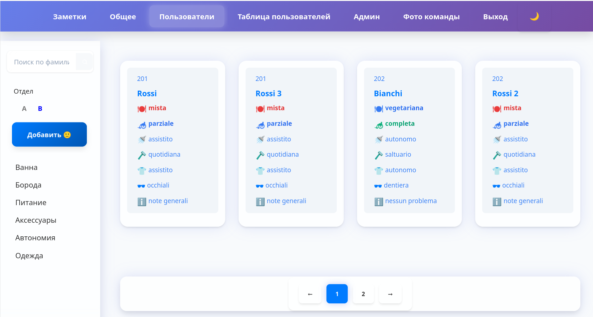
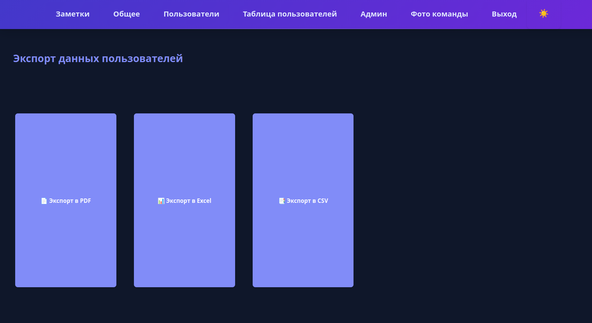
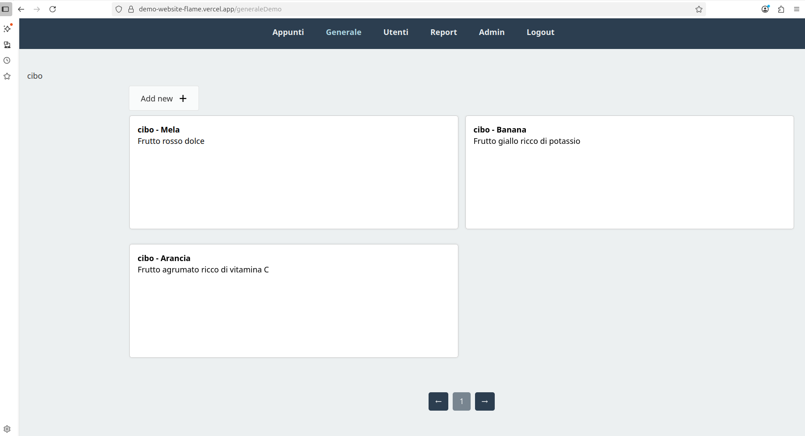
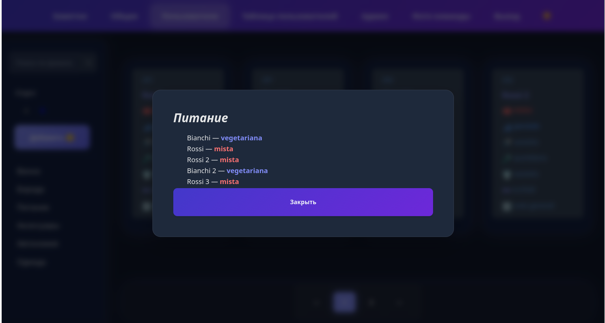
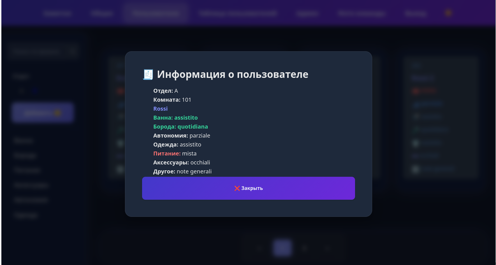
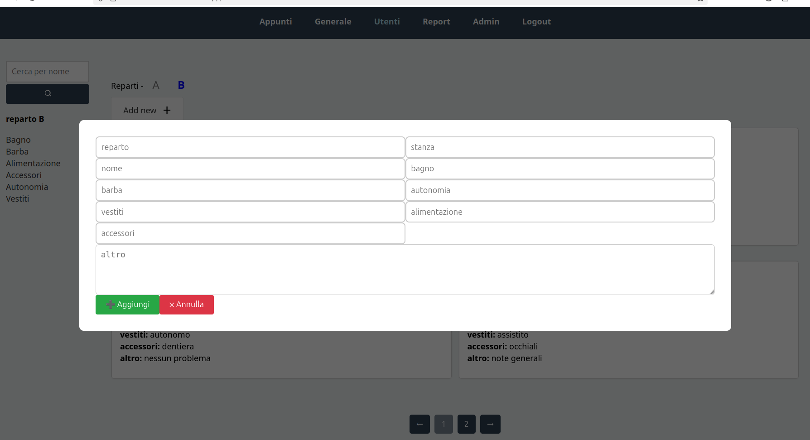
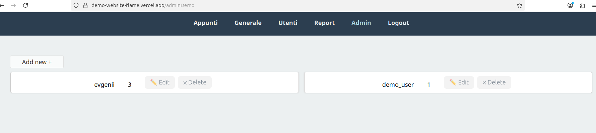
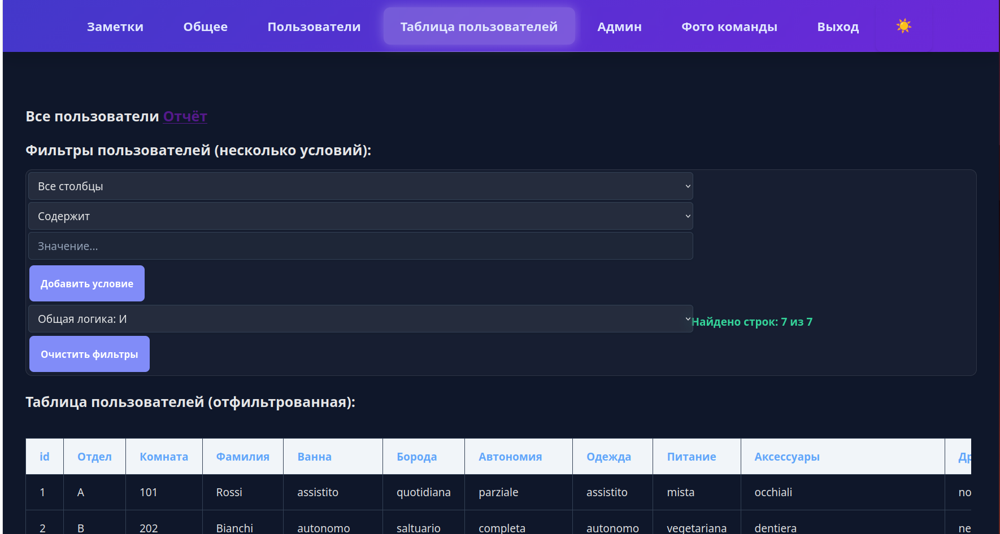
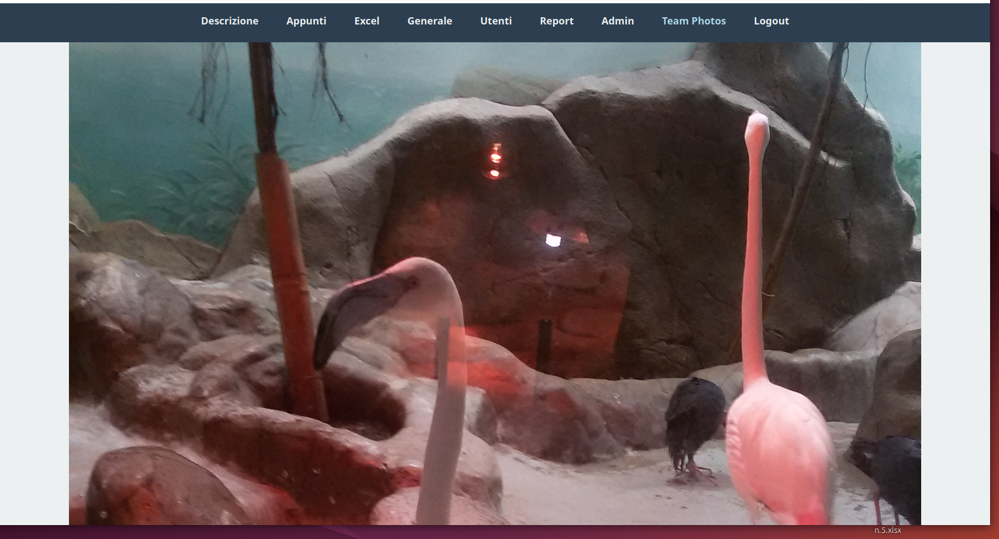

# demo-website-flame - Custom CRM Demo

This is a demo version of a versatile CRM system built with React, Redux, Express, and PostgreSQL. It helps manage data, schedules, and needs efficiently for various use cases, including elderly care, rehabilitation, and more.

## Features
- User management with search and filters
- Categories (e.g., "Reparti") and customizable cards
- Offline support via localStorage
- Admin panel for data control

## Demo
- [Try the Demo](https://demo-website-flame.vercel.app/) (guest(read-only): login: demo, password: demo123)
- Note: This is anonymized sample data for demonstration purposes only.

- 
- 
- 
- 
- 
- 
- 
- 
- 

## Usage
1. Explore the "Utenti" page to see user info.
2. Use the "Generale" section for general facility or project details.
3. Contact me for customization or deployment tailored to your needs.

## Contact
- Email: tsitronov2017@gmail.com
- [Kwork Profile](https://kwork.ru/user/tsitronov2017)

## Tech Stack
- Frontend: React, Redux
- Backend: Express, PostgreSQL (Vercel Postgres)
- Hosting: Vercel

---

# Демо-версия универсальной CRM

Это демонстрационная версия гибкой системы CRM, созданной с использованием React, Redux, Express и PostgreSQL. Подходит для управления данными, расписаниями и потребностями в различных областях, включая уход за пожилыми, реабилитацию и другие сценарии.

## Возможности
- Управление пользователями с поиском и фильтрами
- Категории (например, "Reparti") и настраиваемые карточки
- Поддержка оффлайн-режима через localStorage
- Панель администратора для контроля данных

## Демо
- [Попробовать демо](https://demo-website-flame.vercel.app/) (гостевой вход (read-only): login: demo, пароль: demo123)
- Примечание: Это анонимизированные тестовые данные, предназначенные только для демонстрации.

- 
- 
- 
- 
- 
- 
- 
- 
- 

## Использование
1. Изучите страницу "Utenti" для просмотра информации о пользователях.
2. Используйте раздел "Generale" для общих сведений об учреждении или проекте.
3. Свяжитесь со мной для кастомизации под ваши нужды.

## Контакты
- Email: tsitronov2017@gmail.com
- [Профиль на Kwork](https://kwork.ru/user/tsitronov2017)

## Технологии
- Фронтенд: React, Redux
- Бэкенд: Express, PostgreSQL (Vercel Postgres)
- Хостинг: Vercel
